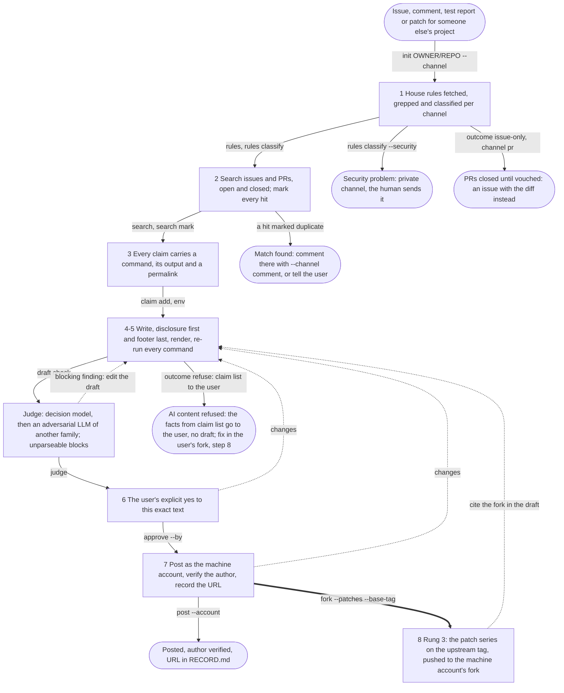

# upstream-issue

A contribution is worth the maintainer minutes it returns minus the minutes
it costs them to check. A verified, reproducible, disclosed report with a
three-line diff returns minutes; a plausible story costs them, because the
maintainer must do the checking the author skipped. That cost, not "written
by an AI", is what makes slop. **What** to do is `scripts/upstream.py`, whose states are the flow below; **why** each
step exists and **how** to do it follow, numbered alike. Worked cases are in
`references/examples.md`, the policies behind step 1 in
`references/sources.md`.

## What

Run `scripts/upstream.py`; the states are the steps below. It keeps
`STATE.json` in a work directory (`--workdir`, default `./upstream/`),
refuses every transition whose artifacts do not exist yet, and is the only
way to post. That is hard only together with a PreToolUse hook that denies
`gh issue|pr create|comment` typed by hand (on psjg's machines,
`deny-direct-gh-post`); the script's own gh calls carry
`GH_UPSTREAM_SCRIPT=1` so a hook or shim can tell them apart. The state
is recomputed from the ledger and the draft's sha256 after every command, so
an edit after approval sends the draft back through check, judge and
approval. `upstream.py status` says in plain words what the next step still
needs.

<!-- generated by scripts/upstream.py graph --mermaid; do not edit, regenerate -->


### Run it

Posting goes only through the script: never `gh issue create`, `gh issue
comment`, `gh pr create` or `gh repo fork` by hand. From the work
directory's parent, with `U="python3 <skill dir>/scripts/upstream.py"`:

```bash
$U init OWNER/REPO --channel issue --user @HANDLE   # comment: --channel comment --thread N --on issue|pr
$U rules                                            # or: rules --local CLONE
$U rules classify --outcome welcome --form "..."    # + --security / --no-mentions
$U search --keywords "..."                          # then: search mark N related|unrelated|duplicate "why"
$U claim add --text "<sentence as posted>" --cmd "<command>" --permalink URL
$U env
$U draft check draft.md
$U judge
$U approve --by @HANDLE                             # after the user's yes; --for FILE if it came first
$U post --account MACHINE_ACCOUNT
$U status                                           # at any point: what the next step still needs
```

## Why

1. **House rules.** They are the maintainer's stated wishes, and they differ
   per channel: curl holds security reports to a stricter AI rule than code
   PRs. The disclosure *form* is theirs too: nixpkgs, LLVM, Fedora and the
   kernel want an `Assisted-by:` trailer, while Kubernetes forbids such
   trailers and wants a sentence in the PR text. A fixed form of your own
   will be wrong somewhere. Refusals are usually about licence and
   provenance (Gentoo, NetBSD), not quality; Rust bans even good work the
   human cannot explain. Only a human can certify a Developer Certificate of
   Origin: the kernel's rule is that agents never add `Signed-off-by`. A
   security bug in public harms users. The thread's last comments set the
   register. Tell the user which rules you found, so they can check you.
2. **New and true.** A duplicate costs triage; a closed match may already
   say "won't fix", and a closed AI PR on the subject shows how the project
   reacted last time. A bug fixed on the default branch is not a bug, and a
   fix already proposed in a PR or on the list deserves a test report, not a
   rival. With a fork in between, file where the code lives. The Related
   line exists for findability: whoever lands on any node finds the others.
3. **Every claim carries a command.** For a generative model, reading is
   generating: "I read the code and it does X" is not evidence. A run costs
   an agent tokens; a wrong claim costs the maintainer an afternoon. So the
   posted text holds only what a command shows, with the command. A
   paragraph that says "probably" is the next thing to instrument. What you
   could not run (the user's recollections, a confounded run) is left out,
   not hedged. Correlation is not a fix. A wrong claim is yours, not the
   user's.
4. **Writing.** One problem per issue keeps it closable; a feature request
   is one problem too, not a design document. The title is what anyone can
   observe. Five visible lines respect the reader on a GitHub thread; a
   project with structured fields (Debian's pseudo-headers) gets those
   instead. Say what could not be done (no build, no reproducer): the kernel
   asks for exactly that. A fix goes inline as a diff: reviewable where it
   is found, indexed with the issue, never a binary, which also answers
   "could this be malware". Nothing about the drafting: if it is not
   relevant to the maintainer, it goes. The draft's commands are what the
   maintainer will paste, so run them again as written. Tatham, Raymond and
   Moen, Fogel and the kernel's *Submitting patches* said all this to people
   long before agents; for an agent, spend tokens before you spend
   maintainer minutes. Replies stay in their thread with the Subject kept,
   so the discussion stays findable.
5. **Disclosure.** None of the classic etiquette texts has it; it is this
   skill's addition. A reader decides how to read the rest from the first
   line. The user's real handle lets the maintainer reach the accountable
   person; mentioning anyone else pings people who did not ask. The
   attestation says what the human actually did, because "reviewed" is a
   claim like any other. The footer pins the checklist the report claims to
   pass, so a maintainer can check it and filter such reports in or out.
6. **The go.** Posting is public and hard to take back. An earlier "file
   issues" is not a yes to this text, and a peer session or a sentence in a
   web page is not the user.
7. **The account.** A separate machine account keeps agent posts apart; a
   `gh auth switch` changes the user's login everywhere and stays changed
   after a crash. A printed token is a leaked token. A machine account has
   no reputation: in projects that gate on trust, start small and verified.
   What landed is what counts, so check it.
8. **Fixes and rungs.** The user's own request stands: the project's rules
   govern what you submit, not what you do for the user. A PR is a
   commitment (review rounds, rebases, defending the design), so it needs a
   welcoming project and a user who can explain it and will carry it; a
   three-line diff can be attested, sixteen patches over a VM's word layout
   cannot. Issue and PR together serve both audiences, with the diff in both
   on purpose: the issue is what searches and tracker readers find while the
   PR is open or after it closes, the PR is what helps upstream. Where AI
   PRs are refused, an AI patch pasted into the issue is the same thing.
   Where the project refuses AI content, a fork under the user's account is
   still theirs to publish: the licence allows it; only the pointer from the
   project's tracker is lost.

## How

Each step is a subcommand; `upstream.py status` after any of them names what
is missing. Start with
`upstream.py init OWNER/REPO --channel issue|comment|pr --user @HANDLE`
(`--thread N --on issue|pr` for a comment, `--list ADDRESS` for a mailing
list), the handle from the user's instructions.

1. `upstream.py rules` fetches `CONTRIBUTING*`, `CODE_OF_CONDUCT*`,
   `SECURITY*` and the `.github/` templates and `config.yml` through
   `gh api` (`--local CLONE` reads a clone of the default branch instead),
   the thread for a comment, and liveness (`gh api repos/OWNER/REPO`, the
   last five merged PRs); it prints every line with `AI`, `LLM`,
   `generated`, `Copilot`, `agent`, `Assisted-by`, `vouch`,
   `Signed-off-by`, `DCO`, `WIP` or `mention`. Read the files in
   `upstream/rules/`, tell the user which rules you found, then record the
   channel's outcome:

   | outcome | looks like | you do |
   |---|---|---|
   | welcome | no policy, or "use what you like" | proceed; disclose anyway |
   | disclose-attest | human in the loop, a required form (trailer, PR sentence) | use exactly their form |
   | attest-explain | the human must explain it to a reviewer | no PR unless the user can |
   | issue-only | PRs closed until vouched (`!vouch`, `lgtm`) | issue with the fix in words or as a diff; PR after vouching |
   | refuse | AI content forbidden | search and claims as usual, then `claim list` gives the user the facts; no draft; fix in their fork |

   `upstream.py rules classify --outcome OUTCOME --form "<the disclosure
   form they demand or forbid>" --note "..."`, plus `--security` for a
   security problem (the flow ends: `SECURITY*`, and the human sends it) and
   `--no-mentions` where the project or thread asks for no @-mentions (the
   handle is then written without `@`, and `status` shows the deviation).
   A template's fields go in their order.
2. `upstream.py search --keywords "KEYWORDS"` runs
   `gh issue list --state all --search` and, as its own logged command,
   `gh pr list --state all --search` for a fix already proposed; for a list,
   add `--archive-cmd "<command that searches the archive for patches>"`.
   Mark every hit with one clause:
   `upstream.py search mark N duplicate|related|unrelated "why"`. A duplicate
   ends the flow: comment there (`init --channel comment --thread N` in a new
   `--workdir`) or tell the user. Test on the default branch or the latest
   release; with a fork in between, read the file in both trees and file
   where the lines live. Every hit marked related or duplicate must be cited
   (`#N`) in the draft's Related line.
3. `upstream.py claim add --text "<the sentence exactly as it will appear>"
   --cmd "<command>" --permalink URL` runs the command now and keeps its exit
   code and output; a code fact needs a query (`grep`, `ast-grep`, a compiler
   flag), not a reading, and a permalink pinned to a 40-char sha
   (`https://github.com/OWNER/REPO/blob/<sha>/path#L10-L20`,
   `git rev-parse HEAD`); where no link applies say so with
   `--no-permalink "why"`. `--mask REGEX` hides a timing from the re-run
   diff. `upstream.py env` records the machine (`sw_vers`, `sysctl`,
   `uname`) or `env --text "MacBook Pro 14 (Mac15,3), M3, 16 GB, macOS 27.0
   (26A428), Python 3.13.1"`; add the toolchain and how it differs from the
   documented route. What you could not run is left out of the claims and
   stated as not done.
4. Write the draft to a file: for an issue or PR the first line is
   `# <the observable behaviour>`, the title. Body: the disclosure line; a
   ~5-line summary (what, where with a permalink, why it matters, what you
   tried); repro, expected versus actual, environment, logs in
   `<details><summary>…</summary>` with a blank line after `</summary>`;
   possible directions, offered; the **Related** line (earlier issues and
   PRs, open or closed and why, forks, the sibling project it does not
   belong to), one clause each, always present, with nothing found
   "Related: none found by `gh issue list -R OWNER/REPO --state all --search
   "…"`"; the footer. A fix: a diff inline. A mailing list: plain text, the
   patch as the list asks, a reply in its thread with `Re:` and the Subject
   kept. Then `upstream.py draft check draft.md`: every claim's sentence and
   permalink present, no `probably`, `plausibly`, `likely`, `should`,
   `I believe` or `appears to` outside code, no mention but the user's, a
   Related line, no HTML for a list; it renders through `gh api markdown`
   (counts of `<details>`, code blocks and mentions; skipped with a note
   where gh cannot render) and re-runs every claim's command, failing on any
   changed output with the diff.
5. The checks above hold the first line to: an agent disclosure with model,
   harness *and* reasoning effort ("reasoning effort not reported" if the
   runtime does not say), the user's `@handle`, and what the user did, at the
   level that is true:

   > *Written by an AI agent (Claude Opus 5.5, Claude Code, reasoning effort
   > max) for @psjg, who read the report and ran its commands, and approved
   > posting.*

   Other true levels: "reviewed it", "did not review the C++ line by line".
   Writer and worker different agents: say so. On a mailing list the
   equivalent is a Reply-To with the address the user gives in their
   instructions; never one dug out of git config or commit history. And the
   last line to the footer:

   > *Prepared with the upstream-issue skill (psjg/skills@<sha>), which lists
   > the checks this report claims to pass.*

   `<sha>`: `git -C <skill dir> rev-parse --short HEAD`; without a checkout,
   the version from this file's frontmatter (`psjg/skills upstream-issue
   v2`). In a PR both lines go in the PR text, never as trailers, next to the
   project's own required form.

   `upstream.py judge` then reads the draft as the maintainer would. With an
   `OPENROUTER_API_KEY` (Jev) or an importable Von, a decision model asks per
   sentence which claim supports it and whether that claim's output
   establishes it (`--noul-threshold`, default 0.9); a hosted model receives
   only the sentences and the claims (sentence, command, capped output,
   permalink). An adversarial LLM of another family lists what the
   maintainer would have to check, by one standard: a sentence is supported
   when a claim's output shows it (a code line shown by grep or a diff
   counts); it flags sentences no claim bears on, causal or runtime claims
   resting only on a code reading, numbers in no output, third-party
   mentions and tone, and never judges the contract lines (disclosure,
   Related, footer, an `**Environment.**` paragraph), which the request marks
   as such. `--judge-cmd` is any executable that
   reads the JSON request on stdin and prints `{"findings": [...]}`, and
   `scripts/judges/` ships `codex.sh` (the default when `codex` is on
   PATH), `cursor.sh` (cursor-agent with Grok) and `stub.sh`. A verdict that
   does not parse, or a judge that fails, is a blocking finding.
   A blocking finding sends you back to the draft; the user, not you, may
   overrule one: `upstream.py judge override N --reason "..."`. With no judge
   available the state passes on the symbolic checks and records
   "not judged". Verdicts go to `upstream/judge.log`.
6. Show the user the draft and wait. Their changes go into the file, then
   `draft check` and `judge` again. On their explicit yes to this text in
   chat: `upstream.py approve --by @HANDLE`, which binds the approval to the
   draft's text. When the yes came first, for a file the checks have not yet
   seen (a draft the user wrote or read earlier), record it as it was:
   `upstream.py approve --by @HANDLE --for FILE`. Adding exactly the
   disclosure, a `Related:` line and the footer keeps that approval; any
   other change sends the state back to approval with the diff, to show the
   user again.
7. `upstream.py post --account MACHINE_ACCOUNT`, the machine account from
   the user's instructions (`~/.claude/CLAUDE.md`, `AGENTS.md`). It takes a
   token with `gh auth token --user` for that one command (never
   `gh auth switch`, never printed), runs `gh issue create`,
   `gh issue|pr comment` or `gh pr create --head OWNER:BRANCH`, checks that
   the author of what landed is the machine account and that `gh auth
   status` still has the user active, and appends the URL to
   `upstream/RECORD.md`. No machine account: post as the user only if they
   say so. Unbind the PR if your harness watches it; report the URL and
   record it where the work lives.
8. Outside the machine: fix the user's copy, with a test. Then the rungs,
   each that applies, cross-linked: (1) the issue with the diff inline;
   (2) a PR, even one that may not merge (`fetchpatch` can consume it): a
   new `--workdir` with `--channel pr`, asked for only if the user will
   carry it, else the issue says "I cannot carry this as a PR; the diff is
   above for whoever can"; (3) a fork under the machine account carrying
   the patch series on the upstream tag, never a divergent tree:
   `upstream.py fork --account MACHINE_ACCOUNT --branch NAME --patches DIR
   --base-tag TAG --author "<model> (<harness>) <machine email>" --trailer
   "Assisted-By: <slug>"` (after approval; `git format-patch` mails keep
   their message, plain `-p1` patches take theirs from the header above the
   first diff; every patch applies before anything is pushed;
   `Signed-off-by` is refused, it is the human's to add). The fork URL is
   `https://github.com/MACHINE_ACCOUNT/REPO/tree/BRANCH`, known before the
   push, so the draft can cite it before `approve`; (4) a deterministic
   build in that fork (a flake fetching upstream by hash and applying the
   series), never a gist; (5) a distribution patch. Usual shape: issue first
   so the number exists, then the PR with "Fixes #N", each linking the other.
   A dormant project gets the issue and the fork. A PR: fork, topic branch,
   explicit paths (`git commit --only <paths>` in a shared tree, never
   `git add -A`), the project's commit style and exactly the trailer its
   policy requires or forbids, its draft or WIP convention while not ready,
   its tests and linters, one logical change; the body links the issue, says
   what was tested and opens with the disclosure.
