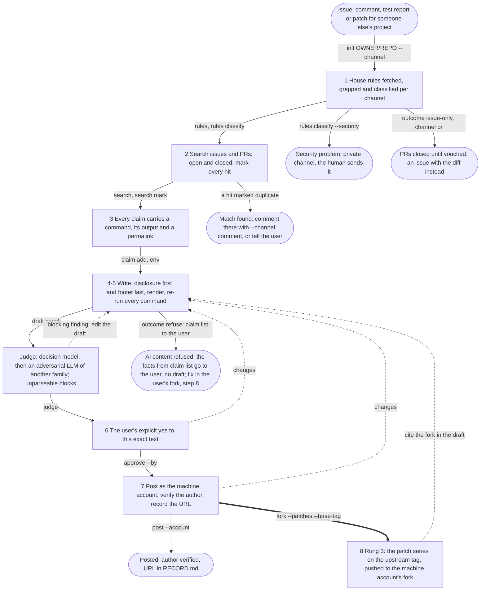

# upstream

A skill for upstreaming: an agent reports to someone else's project with
an issue, a comment or test report on an existing thread, a PR linked to
its issue, or a fork carrying a patch series, and links them to each
other.

## Why it exists

A contribution is worth the maintainer minutes it returns minus the
minutes it costs them to check. A maintainer who receives a plausible
story has to do the checking the author skipped; that cost, not the fact
that a model wrote it, is what projects mean by slop, and it is why a
growing number of them refuse AI content outright. An agent can do the
opposite: spend its own tokens before it spends anyone's minutes. Every
claim in the posted text is a command the maintainer can paste, with its
output and a commit-pinned link. What could not be run is left out, not
hedged.

The classic etiquette texts (Tatham, Raymond and Moen, Fogel, the
kernel's *Submitting patches*) say most of the rest. Two things are this
skill's addition: disclosure, because a reader decides how to read the
rest from the first line; and a hard gate on posting, because "the user
said file issues" is not a yes to this text.

## What it does

`scripts/upstream.py` is the skill as an executable state machine. Each
numbered step is a state, and the script refuses every transition whose
artefacts do not exist yet. `SKILL.md` explains the steps one by one
under Why and gives the commands under How.

<!-- generated by scripts/upstream.py graph --mermaid; do not edit, regenerate -->


The script is the only route to the forge. On the author's machines a
PreToolUse hook denies `gh issue create`, `gh pr create`, `gh issue
comment` and `gh repo fork` typed by hand, so the gate is hard rather
than a request.

## Layout

```
upstream
├── SKILL.md              What (the flow, generated), Why, How
├── README.md
├── scripts
│   ├── upstream.py       the state machine
│   ├── test_upstream.py
│   └── judges            codex.sh, cursor.sh, stub.sh (fails closed), verdict.py
├── references
│   ├── examples.md       worked cases
│   └── sources.md        the project policies and etiquette texts behind step 1
└── evals                 seven scenarios, graded mechanically, run against
                          Claude Code, Codex and Cursor
```
